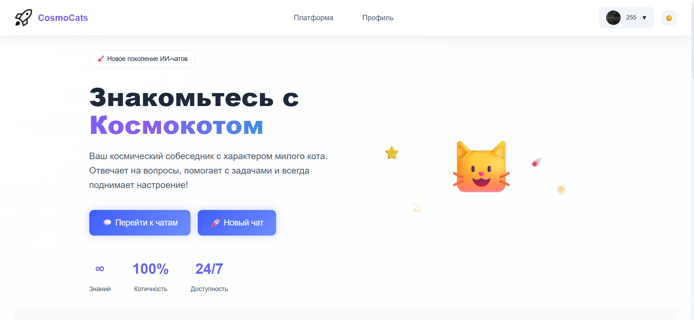
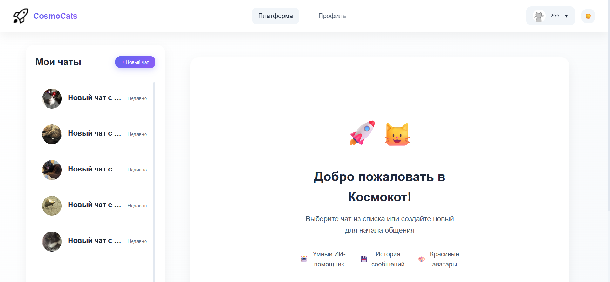
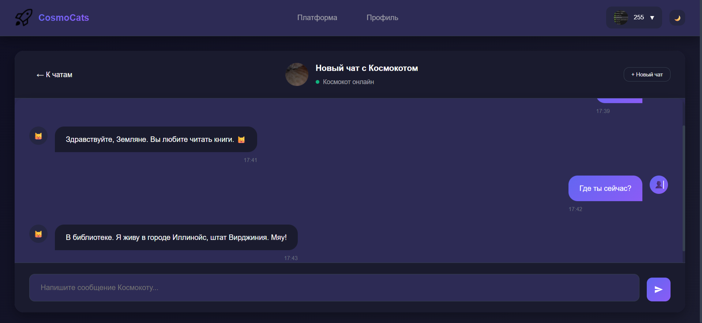
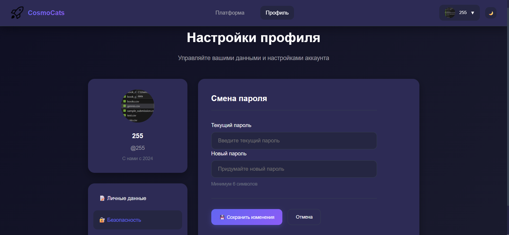
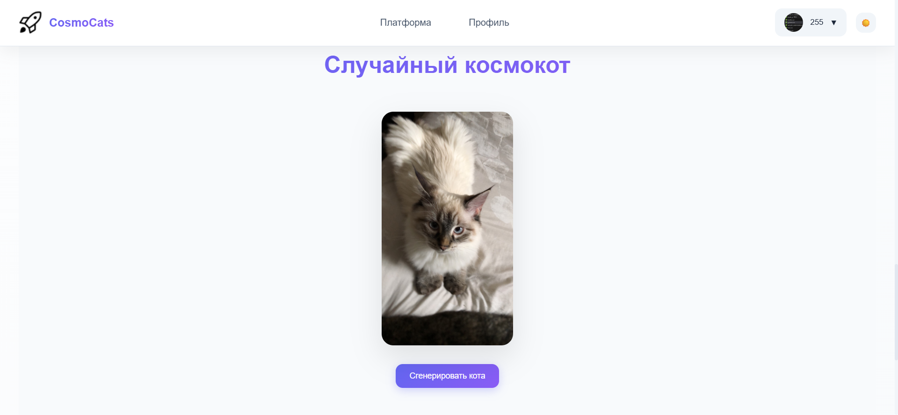

# CosmoCats — веб-платформа

**CosmoCats** — веб-приложение на Flask, где ИИ в образе космического кота (Космокота) отвечает на вопросы пользователей. Интерфейс включает чаты, регистрацию, профили с аватарами (генерируемыми из aleatori.cat), поддержку русского языка и темную/светлую темы.

Проект реализован для демонстрации интеграции локальной ИИ-модели с веб-интерфейсом, с акцентом на простоту, юмор и космическую тематику.

---

### Участники проекта:
- [alikhn11](https://github.com/alikhn11) — дизайн, страницы index.html, base.html
- [timurkoblov-rgb](https://github.com/timurkoblov-rgb) — дизайн, страницы login.html, register.html

В разработке использовались ИИ-инструменты, такие как DeepSeek и Qwen, для помощи в кодинге и отладке.

## Как начать разработку

### 1. Установка зависимостей
Создайте виртуальное окружение и установите пакеты:

Для Unix-like (Linux/Mac):
```bash
python -m venv .venv
source .venv/bin/activate
pip install -r requirements.txt
```

Для Windows:
```powershell
python -m venv .venv
.\.venv\Scripts\Activate.ps1
pip install -r requirements.txt
```

### 2. Загрузка модели ИИ (обязательно для полной функциональности)
При первом запуске приложение автоматически скачает модель `ai-forever/rugpt3small_based_on_gpt2` (~500 МБ) из Hugging Face. Модель сохранится в папку `model_cache/` (добавьте её в `.gitignore` для игнора в Git).

Скачивание происходит при первом обращении к `/platform` или чату. Первый запуск может занять 2–5 минут в зависимости от скорости интернета.

После загрузки модель работает локально без интернета. Приложение может функционировать и без ИИ (в fallback-режиме с случайными ответами).

### 3. Запуск сервера
```bash
python app.py
```
Откройте в браузере: http://127.0.0.1:5000

#### 📂 Структура проекта
- `app.py` — основной Flask-сервер, маршруты, интеграция модулей.
- `auth_manager.py` — регистрация, вход, управление сессиями.
- `db_manager.py` — работа с SQLite (база данных для пользователей и чатов).
- `ai_core.py` — ядро ИИ: загрузка модели, генерация ответов, fallback-режим.
- `profile_manager.py` — управление профилем (имя, пароль, аватар).
- `chat_manager.py` — создание/управление чатами, история, аватары.
- `templates/` — HTML-шаблоны (base.html, index.html, chat.html и т.д.).
- `static/` — CSS, JS, favicon.ico.
- `assets/` — rocket.png, default_avatar.png.
- `model_cache/` — кеш модели ИИ (игнорируется в Git).
- `requirements.txt` — список зависимостей.


## Галерея проекта






